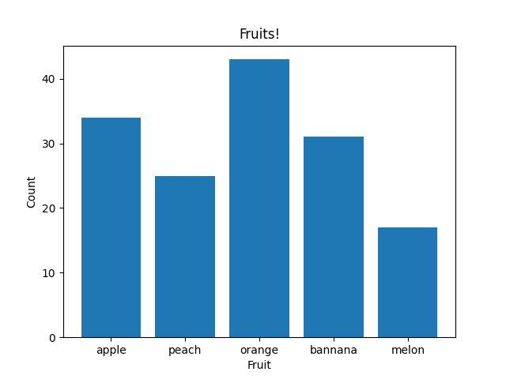
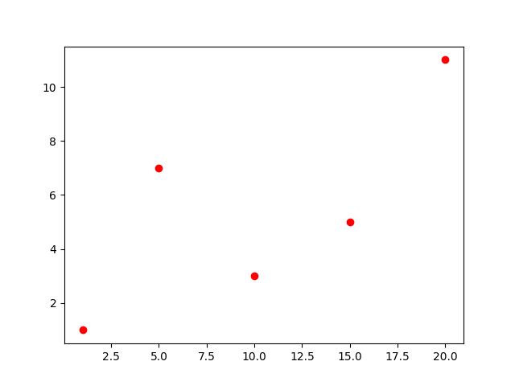
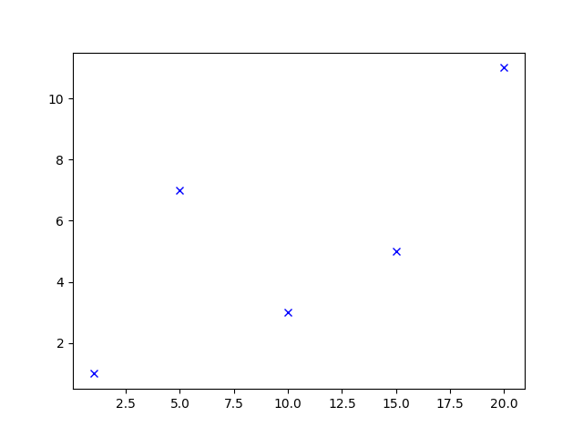
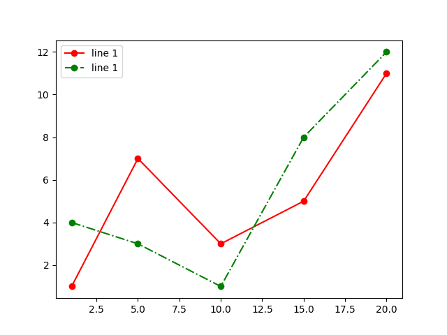
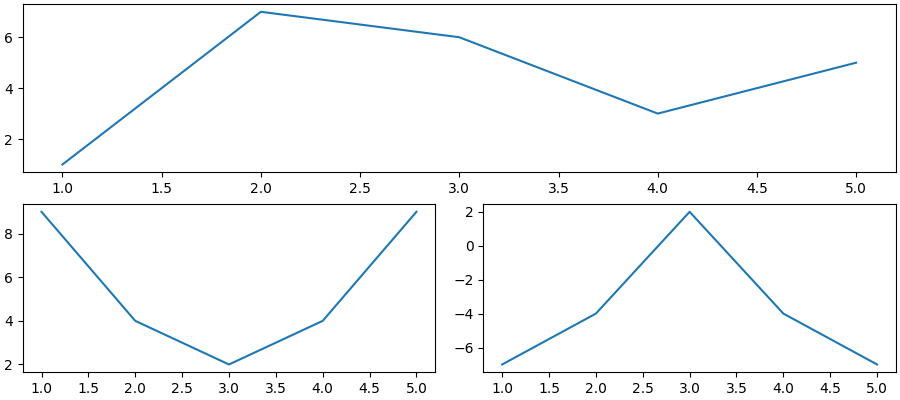
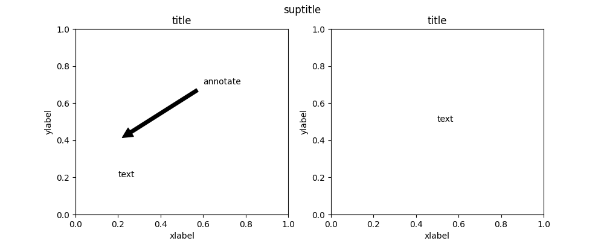
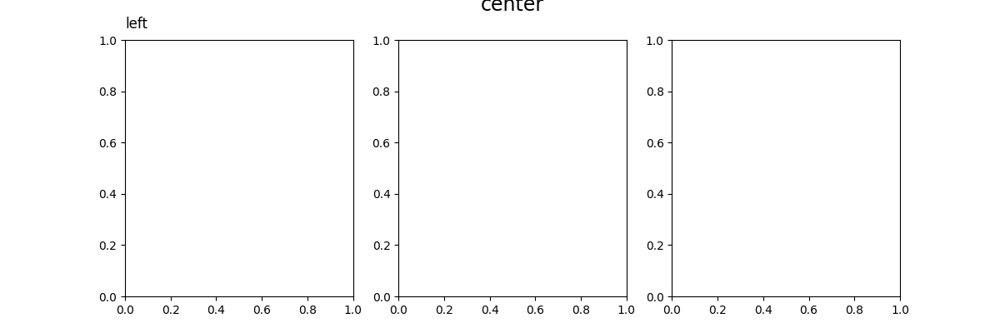
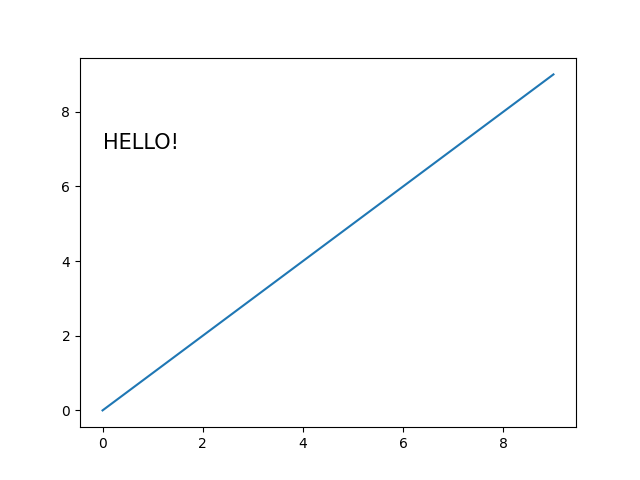
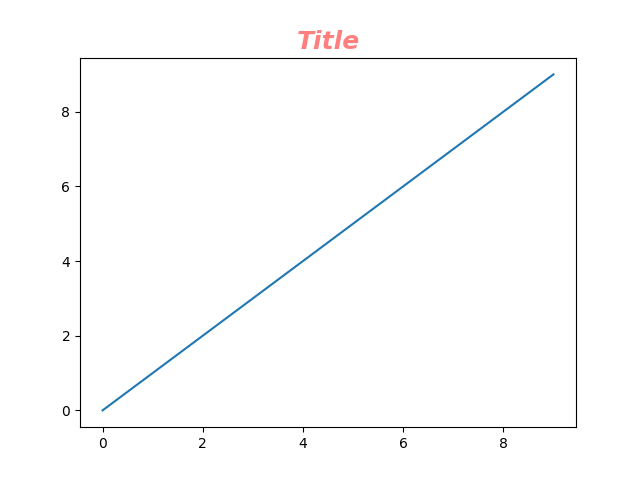

# Лаборатортная работа
## Сложность: Rare
## Вариант №2
### Задание
1. Создайте в каталоге для данной ЛР в своём репозитории виртуальное окружение и установите в него ```matplotlib``` и ```numpy```. Создайте файл ```requirements.txt```.
2. Откройте книгу и выполните уроки 1-3. Первый урок можно начинать со стр. 8.
3. Выберите одну из неразрывных функции своего варианта из лабораторной работы №2, постройте график этой функции и касательную к ней. Добавьте на график заголовок, подписи осей, легенду, сетку, а также аннотацию к точке касания.
4. Добавьте в корень своего репозитория файл ```.gitignore```, перед тем как делать очередной коммит.
5. Оформите отчёт в ```README.md```. Отчёт должен содержать: 
    - графики, построенные во время выполнения уроков из книги 
    - объяснения процесса решения и график по заданию 4
6. Склонируйте этот репозиторий НЕ в ваш репозиторий, а рядом. Изучите использование этого инструмента и создайте pdf-версию своего отчёта из ```README.md```. Добавьте её в репозиторий.
### Ход работы
#### Задание 2
#### 1

#### 2

#### 3

#### 4

#### 5

#### 6

#### 7

#### 8

#### 9

#### 10

#### 11

#### 12

#### 13

#### 14

#### 15

#### 16

#### 17

#### 18

#### 19

#### 20

#### 21

#### 22

#### 23

#### 24

#### 25

#### 26

#### 27

#### 28

#### 29

#### 30

#### 31

#### 32

#### 33

#### 34

#### 35

#### 36

#### 37

#### 38

#### 39

#### 40

#### 41

#### 42

#### 43

#### 44

#### 45

#### Задание 3

$f(x) = e^{sin{x}}$

```python
#!/usr/bin/env python3
# -*- coding: utf-8 -*-import numpy as np

import matplotlib.pyplot as plt

def f(x):
    return np.exp(np.sin(x))

def df(x):
    return np.cos(x) * np.exp(np.sin(x))

x = np.linspace(-np.pi, np.pi, 100)

plt.plot(x, f(x), label='f(x) = e^sin(x)')

tgx = np.pi/4
tgy = f(tgx)
tgslope = df(tgx)
tg = tgy + tgslope*(x - tgx)

plt.plot(x, tg, label='Tg')
plt.scatter(tgx, tgy, color='red', label='Точка касания')
plt.title('График функции f(x) = e^sin(x) и её касательной')
plt.xlabel('x')
plt.ylabel('f(x)')
plt.legend()
plt.grid(True)
plt.annotate('Точка касания', xy=(tgx, tgy), xytext=(tgx-2, tgy+0.2), arrowprops=dict(facecolor='black', arrowstyle='->'))
plt.show()
```
#### Иллюстрация решения задачи


